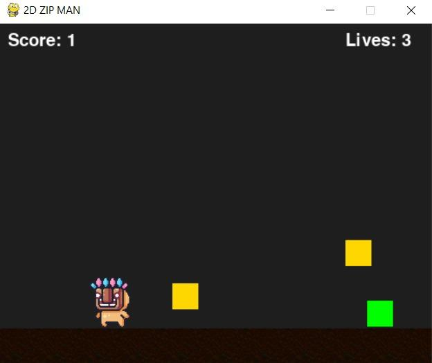
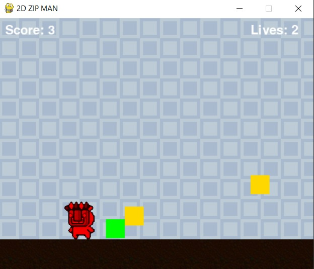
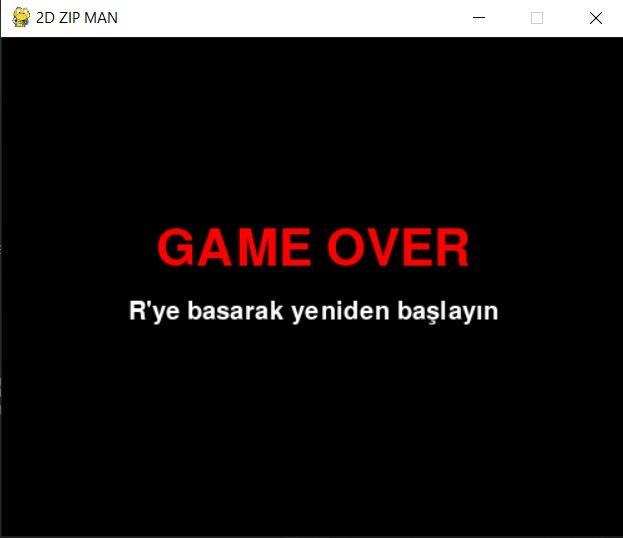

# SELYM-ZIP MAN

**SELYM-ZIP MAN**, Python ve Pygame kullanılarak geliştirilmiş bir 2D engelden kaçma oyunudur. Oyuncu, karşısından gelen düşmanlardan kaçarak mümkün olduğunca uzun süre hayatta kalmaya çalışır. Oyun, temel animasyonlar, çarpışma kontrolü ve skor sistemi içerir.

## 🎮 Oyun Özellikleri

- Oyuncu karakteri sağa ve sola hareket eder.
- Rastgele konumlanan düşmanlar yukarıdan düşer.
- Skor hayatta kalma süresine göre artar.
- Çarpışma durumunda oyun sona erer.
- "Tekrar Dene" seçeneği ile yeniden başlatılabilir.

## 🛠 Kullanılan Teknolojiler

- Python 3.x
- [Pygame](https://www.pygame.org/)

## 🚀 Kurulum ve Çalıştırma

1. Projeyi klonlayın:

   ```bash
   git clone https://github.com/kullaniciadi/selym-zipman.git
   cd selym-zipman

Gerekli bağımlılığı yükleyin:
  pip install pygame

Oyunu başlatın:
  python main.py

### 📦 Kullanılan Kaynaklar ve Varlıklar (Assets)

Bu projede kullanılan oyun görselleri ve grafik varlıklar aşağıdaki kaynaklardan alınmıştır:

- 🎨 [OpenGameArt.org](https://opengameart.org/)  
  Ücretsiz ve açık lisanslı oyun varlıkları sunan bir platformdur. Projedeki bazı görseller ve arka planlar buradan alınmıştır.

- 🎮 [Kenney.nl](https://kenney.nl/assets)  
  Kaliteli 2D/3D oyun varlıkları sağlayan popüler bir kaynaktır. Oyuncu karakteri ve kullanıcı arayüzü öğeleri Kenney tarafından sağlanan varlık paketlerinden alınmıştır.


##  Oyun Görselleri

  


  


  


