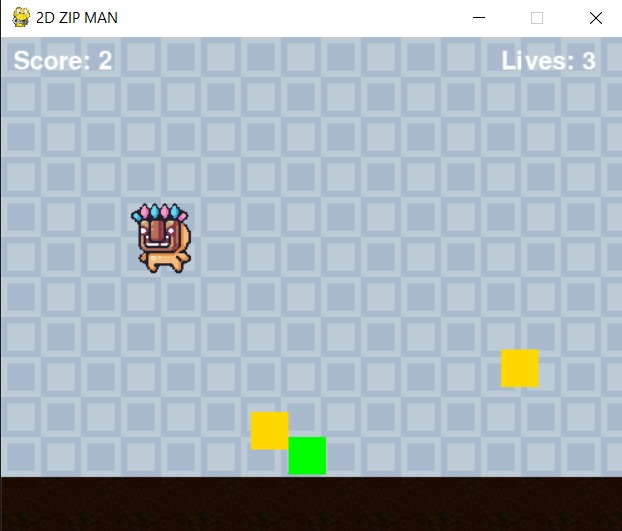

# SELYM-ZIP MAN

**SELYM-ZIP MAN**, Python ve Pygame kullanılarak geliştirilmiş bir 2D engelden kaçma oyunudur. Oyuncu, yukarıdan gelen düşmanlardan kaçarak mümkün olduğunca uzun süre hayatta kalmaya çalışır. Oyun, temel animasyonlar, çarpışma kontrolü ve skor sistemi içerir.

## 🎮 Oyun Özellikleri

- Oyuncu karakteri sağa ve sola hareket eder.
- Rastgele konumlanan düşmanlar yukarıdan düşer.
- Skor hayatta kalma süresine göre artar.
- Çarpışma durumunda oyun sona erer.
- "Tekrar Dene" seçeneği ile yeniden başlatılabilir.

## 🛠 Kullanılan Teknolojiler

- Python 3.x
- [Pygame](https://www.pygame.org/)

## 🚀 Kurulum ve Çalıştırma

1. Projeyi klonlayın:

   ```bash
   git clone https://github.com/kullaniciadi/selym-zipman.git
   cd selym-zipman

Gerekli bağımlılığı yükleyin:
  pip install pygame

Oyunu başlatın:
  python main.py

##  Oyun Görselleri

Oyunun oynanışından bazı ekran görüntüleri:

  
*Oyun başlangıç ekranı*

  
*Oyuncunun düşmanlardan kaçtığı an*

  
*Çarpışma sonrası oyun bitiş ekranı*

